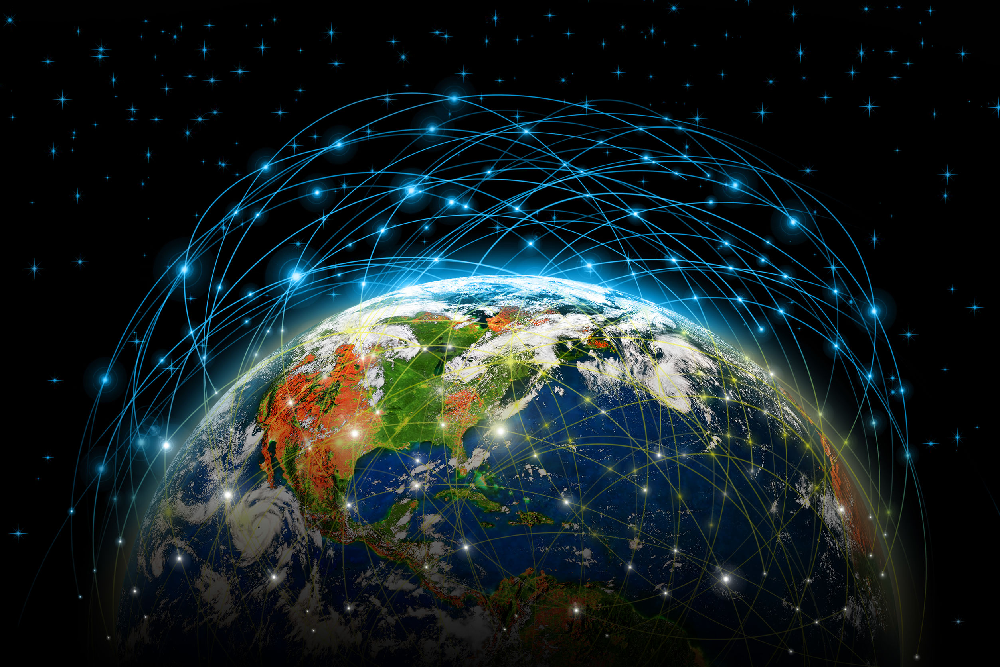

# The Internet: As Understood by Chris 
## | [Origins](Origins.md) | [Infrastructure](Infastructure.md) | [Horizon](Future.md) | [About Me](about.md) |
> ***"We are all now connected by the Internet, like neurons in a giant brain."*** - Stephen Hawking
## The Internet is a massive series of interconnected channels for data to travel through. This network is reliant on both physical infrastructure and software controls to get this data to move through it smoothly.
## Let's explore...
 - Image to be background. 

