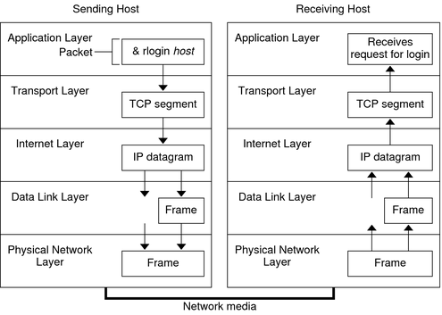

# Infrastructure in a Nutshell 
## | [Home](HW2_InternetWebsite.md) |[Origins](Origins.md) | [Horizon](Future.md) | [About Me](about.md) | 
> ***"Move fast with stable infrastructure."*** - Mark Zuckerberg. 
### The Internet is made up of a network made up of 3 main structures. Clients, servers and nodes. A client requests data from the network, the servers are where that data is stored and the nodes relay data between clients and servers. Transmission between these structures is established through copper wires, fiber optics, and wireless signals ...normally a combination of the 3. 
## Let's explore...
---
## Protocols
* Protocols are sets of instructions and standards that computers follow to operate. 
* For a device to operate as intended on the Internet it needs to follow a series of protocols, otherwise their would not be a common "language" for devices on the Internet to connect with. 
* The protocol stack used to communicate on the Internet is called the TCP/IP. This stands for Transmission Control Protocol and Internet Protocol respectively. 
* The Transmission Control Protocol handles incoming packets and directs them to a specific location on your computer. 
* The Internet Protocol handles outgoing packets and directs them to a specific IP address.
* The basic flow required for host-to-host communication over the internet is as follows: 
  1. Local application protocol layer for creating a message and parsed into uniform packets. 
  2. The TCP layer assigns each packet a port number so that the receiving computer can identify which program it will need to receive the message. 
  3. Now the packets pass through the IP layer which will give each packet a destination TCP header. 
  4. Ready to enter the subnet the packets need to pass through the hardware layer that will translate their bits into electrical pulses that can traverse the Internet. 
  5. As the packets navigate the network they travel from ISP router to the next. ISP or Internet Service Provider routers will examine the TCP headers of each packet and determine where to send it next, many times this will be another ISP router. 
  6. At some point the packets will reach their destination IP address and they will be reassembled into the transmitted message.
---

> This TCP/IP diagram illustrates the path that data follows in order to traverse the TCP/IP layers . 
---
## Packets 
* When data travels through the Internet it is parsed into a series of uniform packets of 1,000 to 1,500 bytes. As these packets traverse the network they each follow a path of least resistance. This is an important design feature of the packets system. This way if part of the network were overwhelmed with traffic or destroyed these packets could still reach their destination by following alternative paths. 
* Packets are able to reach their destination and assembled properly because of their TCP Header and Footer. The Header and the Foot tells the routing devices and receiving computer what is in the packet, how the it fits back together and it's destination. 
---

> Transfer Control Protocol Header
---
## Dynamic Host Configuration Protocol (DHCP)
* This protocol is responsible for assigning your computer network configurations such as an IP address or the DNS servers. 
* Due to the dynamic nature of this protocol a user may have a different IP address from time to time.  
* There are however exceptions to this protocol. For instance web servers and other devices that need a consistent point of contact use a Static IP address. Basically when this is the case the same IP address is always assigned to that web server or device. 
* This is made possible by the Internet Protocol associating the specific IP address with the MAC or Media Access Control address for that networked service or device that is assigned to it when it is built. 
## IP Address 
* Any device connected to the internet needs to have a unique address where it can be identified to receive or send data. This address is formatted as x.x.x.x where x will be a number from 0 to 255. This address is called an IP address or Internet Protocol Address. 
* When you connect to an Internet Service Provider you are assigned a network dependent IP address by the modem or router. 
* Currently the most of the IP addresses used are IPv4 which is a 32-bit address system which yields 4,294,967,296 available addresses. The world is quickly running out IP addresses with this system. 
* The Internet is in the process of transitioning over to a IPv6 system that would yield 340,282,366,920,938,463,463,374,607,431,768,211,456, more grains of sand than there is on the planet.  
## Domain Name System (DNS)
* DNS is a standard protocol within the software architecture that allows the network of the Internet to operate. 
* Essentially what it does is it connects the user's input domain address (ex: www.example.com) with that website's IP address. 
* The Domain Name System does this by storing all of the Internet's domain names and IP addresses on it's servers in a massive hash table that when queried with a domain name it can quickly reference corresponding IP address. 
* The process the DNS uses to locate the corresponding IP address to the quired domain name is called DNS name resolution. 
* Generally when you connect your device to a network router or modem the device is send a network configuration bundle that includes an IP address as well as DNS servers that your device can then use. 
## Domain Names
* Domain names exist for us, the people that use the internet. It is much more simple for a person to remember www.example.com instead of the website's IP address. 
* The Domain Name normally has 3 levels to it. Each level refers to a server that manages that domain level.   
  1. Host Name: This is the first word in the Domain Name. It specifies the name of the machine in a domain. 
  2. Second-Level Domain: This is the middle word or name of the Domain Name. It will normally represent the actual name of the website. 
  3. Top-Level Domain: This is the last word of the domain name and identifies who operates or services the site. 
      * Ex: com - for commercial endeavors org - for non-profit organizations net - for network providers mil - for military organizations gov - for government organizations edu - for educational organizations info - for entities providing information services
* Hypertext Transfer Protocol (HTTP) - This is the protocol that handles information sent by the user to a website. 
## Internet Service Provider (ISP) 
* The ISP is a company that offers access to the Internet. ISPs act as the gateway to the Internet, route Internet traffic, maintain the hardware infrastructure, and resolve domain names with the DNS. 