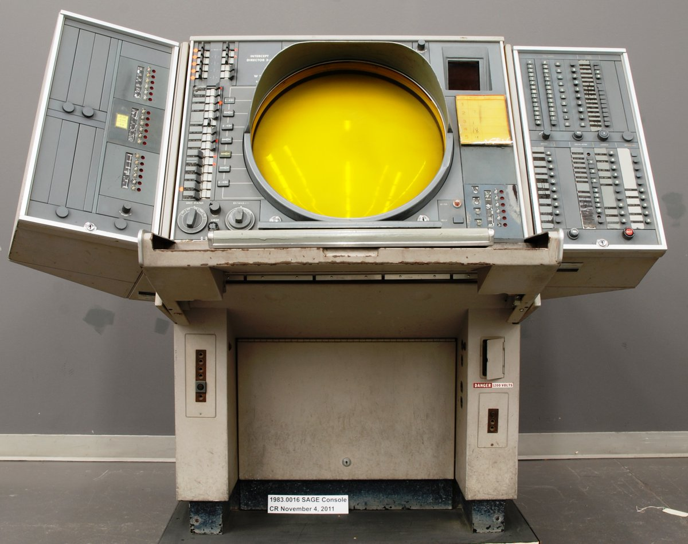
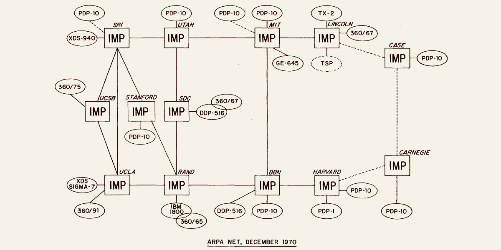
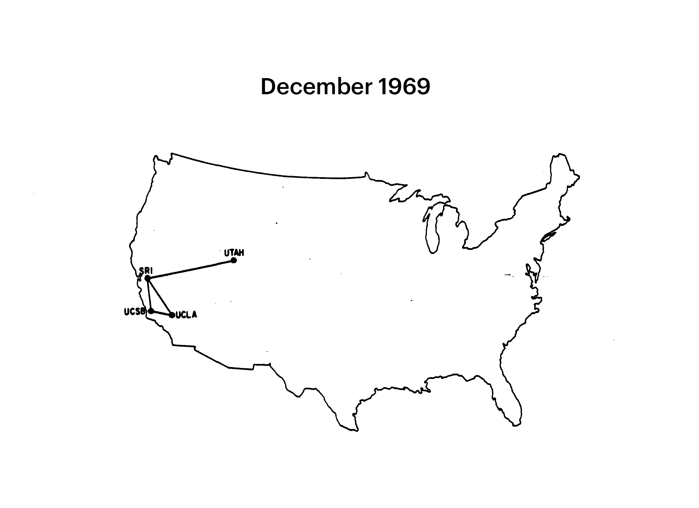

# Origins
## | [Home](HW2_InternetWebsite.md) | [Infrastructure](Infastructure.md) | [Horizon](Future.md) | [About Me](about.md) |
> ***"Study the past if you want to define the future.*** - Confucius
### As is common with many revolutionary innovations the initial desire for the ‘internet’ was to make more effect war. A decentralized communications network would serve as an indestructible medium in the case that lines of communication were to be targeted. 
## War what is it good for...?
   * The fear was during the Cold War if telephone communications were taken out America would not have a means of coordinating retaliatory or defensive measures. 
   * Circuit switching - telephones - require direct contention path or circuit.  
      * If the phone circuit is broken, it’s useless. 
* At MIT during the 1950s American Psychologist and Computer Scientist J.C.R Licklider proposed the seminal idea of networked devices. 
* At this time computers were vilified by the entertainment industry as alien technology in the pursuit of human obliteration. 
## 1957 - Space Race
* The Soviet Union launched the first satellite into orbit around the Earth, Sputnik. 
* In reaction to the Soviet Union’s space program’s success Eisenhower established a new agency in the Bureau of Defense called the Advanced Research Project Agency or ARPA for short. 
   * ARPA was in charge of the USA space program prior to NASA. 
      * Naturally emerging computer science would fall under ARPA’s research efforts especially in relation to the space program. 
   * In July 1958 the space program got a dedicated agency, NASA, and Computer Science research fell into obscurity in the public’s eye. 
* The Cold War begins. Tensions between the USA and the Soviet Union reach a new high. The threat of nuclear war was as high as it ever had been. 
## 1962 - J.C.R. Licklider: An Intergalactic Vision
--- 

> Have text wrap around. 
* J.C.R. Licklider theorized in his seminal paper about the symbiotic relation that would grow between humans and computers. Licklider outlined the need for a seamless interaction between humans and computers. Licklider is considered a pioneer of artificial intelligence. 
* Licklider went on to contribute to early research efforts into the world of networking. In fact he is credited with formulating the earliest ideas of a global computer network at Bolt, Beranek and Newman Inc.(BBN,Tech R&D). Discussed in numerous memos at BBN Licklider proposed the concept of an Intergalactic Computer Network that outlines essentially what our Internet has become today. 
* His work and funding served as the inspiration and foothold for many other Networking pioneers. 
## 1968 - The Computer as a Communication Device 
* "Creative, interactive communication requires a plastic or moldable medium that can be modeled, a dynamic medium in which premises will flow into consequences, and above all a common medium that can be contributed to and experimented with by all."
* This futurist paper written by J.C.R. Licklider and Robert W. Taylor illustrates how the leap from commonplace telecommunications to a more sophisticated network of multi-access computers would dramatically improve creative communication and problem solving. 
  * Proposing the idea that a network of computers would mean amplified human intelligence. An extension and supplementation of the mind. 
  * This paper theorizes about the types of communities that can grow out of a networked system of general purpose computers. Introductions, discussions, and parting all happening on-line. 
    > "First, life will be happier for the on-line individual because the people with whom one interacts most strongly will be selected more by commonality of interests and goals than by accidents of proximity. Second, communication will be more effective and productive, and therefore more enjoyable. Third, much communication and interaction will be with programs and programmed models, which will be (a) highly responsive, (b) supplementary to one’s own capabilities, rather than competitive, and (c) capable of representing progressively more complex ideas without necessarily displaying all the levels of their structure at the same time-and which will therefore be both challenging and rewarding. And, fourth, there will be plenty of opportunity for everyone (who can afford a console) to find his calling, for the whole world of information, with all its fields and disciplines, will be open to him—with programs ready to guide him or to help him explore."
## 1965 - MIT Lincoln Lab Experiment 
* Lawrence G. Roberts and Thomas Marill connected a TX-2 at MIT Lincoln Lab to a Q-32 at System Development Corporation in Santa Monica, California using a telephone line on lease from Western Union. 
  * Head of APRA's Information Processing Techniques Office(IPTO), Ivan Sutherland, decided it was time that research was put into the complications with interconnecting computers. 
  * Sutherland gave the project to Larence G. Roberts who then contracted Thomas Marill, former student of Licklider and the founder of the time-sharing company Computer Corporation of America. 
--- 

> Semi-Automatic Ground Environment (SAGE) was the result of early experimentation in computer networks. MIT Lincoln Lab developed a digital computer that could receive vast quantities of data from multiple radars and perform real-time processing to produce targeting information for intercepting aircraft and missiles. This is one of this system's display consoles. 
* These early computer network utilized Circuit Switching technology. This was the standard switching technology that the phone companies used at this time. 
* This was a slow and laborious process of having to have a dedicated connection between the two interfacing computers. Not at all suitable for computer communication that takes seconds to terminate. 
## 1962 - Paul Baran: On Distributed Communications Networks 
* Paul Baran was a researcher at RAND Corporation that was in joint research with the US AirForce. Baran proposed a program to solve the communications vulnerability that existed in event of a nuclear attack on US soil. The issue being that all military strategic command and communications relied on the standard Circuit Switching network of telephone lines. The system is Centralized, so in the occurrence of a few well attacks the US military's communications would be disabled. 
* Baran proposed a "Fish-Net" like network that utilized a store-and-forward message switching system in which each node or communication device of the network would treat a message, in it's entirety, like a "hot-potato" and continually attempt to pass it on to the next available node. Due to the "Fish-Net" structure of the network each node would have numerous routes to pass the message along by choosing alternate routes if it's preferred route is overwhelmed or disconnected.  
## 1966 - Donald Davies: Packet Switching
* Davies proposed that if you had high data rates and short messages  the storage time delay that was present with Message Switching could be avoided. 
* A message block for instance would be parsed up into uniform "packets" and then distributed throughout the Distributed Network. this could ensure that a messaging to be traversed through the network would not be to large to cause any storage delays at nodes.
* Each packet would find it's own unique way to it's destination based on node conditions and traffic. Once arriving at it's destination the packets would be reassembled into the message. 
---

---
* At this time however packet switching within a distributed network was riddled with dozens of execution dilemmas. One of the major road-blocks being that a network for this to operate within did not exist and would not for another 22 years. 
## 1967 - Arpanet Beginnings 
* In 1966 Robert W. Taylor replaced Sutherland as the Director of the Information Processing Techniques Office and was motivated to work on a problem that was perfectly illustrated by the terminals in his office. Taylor had 3 terminals in his office, one for interacting with a single time-sharing system. This led him to imagine interconnecting each of those time-sharing systems or computers.  
* Taylor procured 1 million dollars of funding from the Director of ARPA, Charles Hertzfeld, to begin working on this networking endeavor. 
* Lawrence Roberts was recruited to manage the program, as his experiment at MIT Lincoln Lab was very similar to what they wanted to achieve. 
* One of the first challenges was how they were going to build this packet-switching network and how would computers even communicate across such a network. what sort of network topology would be best? 
* At this time all of Baran and Davies work on Distributed Message Switched Systems were theoretical and had not been realized at this scale. These were uncharted water's for sure. 
* One of the major issues with this type of system was how to get different computers with different architectures to be able to communicate. 
* Welsey Clark came up with the idea of having a companion computer that would accompany the mainframe and perform all of the network functions. This in a sense would circumvent the complications of networking mainframes with different architectures together. The mainframes would not need to be able to communicate with other mainframes in network they would only need to be able to communicate with their network companion and then the network companions would communicate with each other. These companion computers became know as IMPs or Interface Message Processors. 
* IMPs would be connected together with telephone lines and modems resulting in a message-switching subnet. 
--- 

> This diagram illustrates how the IMPs act as a gateway between separate computers. 
---
* Generally how this network would work is that the mainframe would create a message and send this message to the IMP. The IMP would parse the message into uniform packets. The IMP would when transmit these packets through the subnet of telephone lines, modems, and other IMPs using a hot potato routing algorithm. Each packet could take it's own unique path through the subnet to maximize efficiency. Once the receiving IMP counts all expected packets it can reassemble them and then forward the message to the mainframe/host. 
## 1968 - Request for Quotation 
* Roberts was in a dilemma. To build this network they needed a team that could create the IMPs and figure out how they would fit into the network. 
* The bid described that 4 computers were to be networked together using IMPs with a potential 35 if the 4 were successful. 
  * UCLA, SRI, UCSB, and University of Utah. 
* Most prospective contractors were not enthusiastic about bidding on the project. This would require a dedication of their resources and most did not deem it feasible. 
## 1969 - Arpanet is Born
* Bolt, Beranek and Newman ended up winning the bid over Raytheon due to their unique team composition. 
* Frank Heart, head of Division 6 at BBN, headed the team who included Severo Ornstein, Will Crowther, Dave Walden, and Robert Kahn. Most all of these members were part of the MIT Lincoln Lab at one point and all had experience building out real-time computer systems. 
* At the beginning of September 1968 BBN delivered the first IMP to UCLA. 
* Each site had a representative that met to coordinate on host-to-host protocols within the subnet. This group eventually grew to hundred of professionals and became known as the NWG or the Networking Working Group in 1970.
* By the end of the year all 4 original sites received their IMPs and the network was born. However there were still many questions to be answered.  
## 1972 - International Conference  on Computer Communications 
* This was mainly a result of Robert's belief that a global demonstration of Arpanet would help to convert other host sites to be apart of the Arpanet network. 
* At this time Arpanet had about 18 participants in their network with about 25 different "sites" on it. 
---

> Spread of Arpanet
---
* This conference served to inspire some of the brightest minds in the world of computing to assume new roles in the evolving field of computer communications. 
* Arpanet's Packet Switching Network served as a catalyst for a whirlwind of innovation and research in the world of computer networks that continues to this day. 
## World Wide Web - Tim Berners-Lee 
---

> Needs to be smaller
---
* Berners-Lee worked at CERN (European Council for Nuclear Research) in the 1980s. 
* This organization was tasked with studying fundamental laws of physics and the nature of the universe. 
* Berners-Lee was tasked with building a local network to allow researches to because to share and collaborate more easily. 
* He achieved this by building an interface using HTML, HTTP, and URLs and named it the " World Wide Web". 
* The first website ever made was made by Tim Berner-Lee in France in 1991. 
* This was the true birth of what we think of as the Internet today. A graphical interface that allows the user to effortlessly navigate the Internet. 